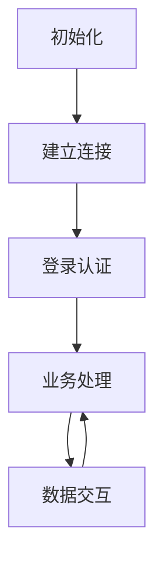
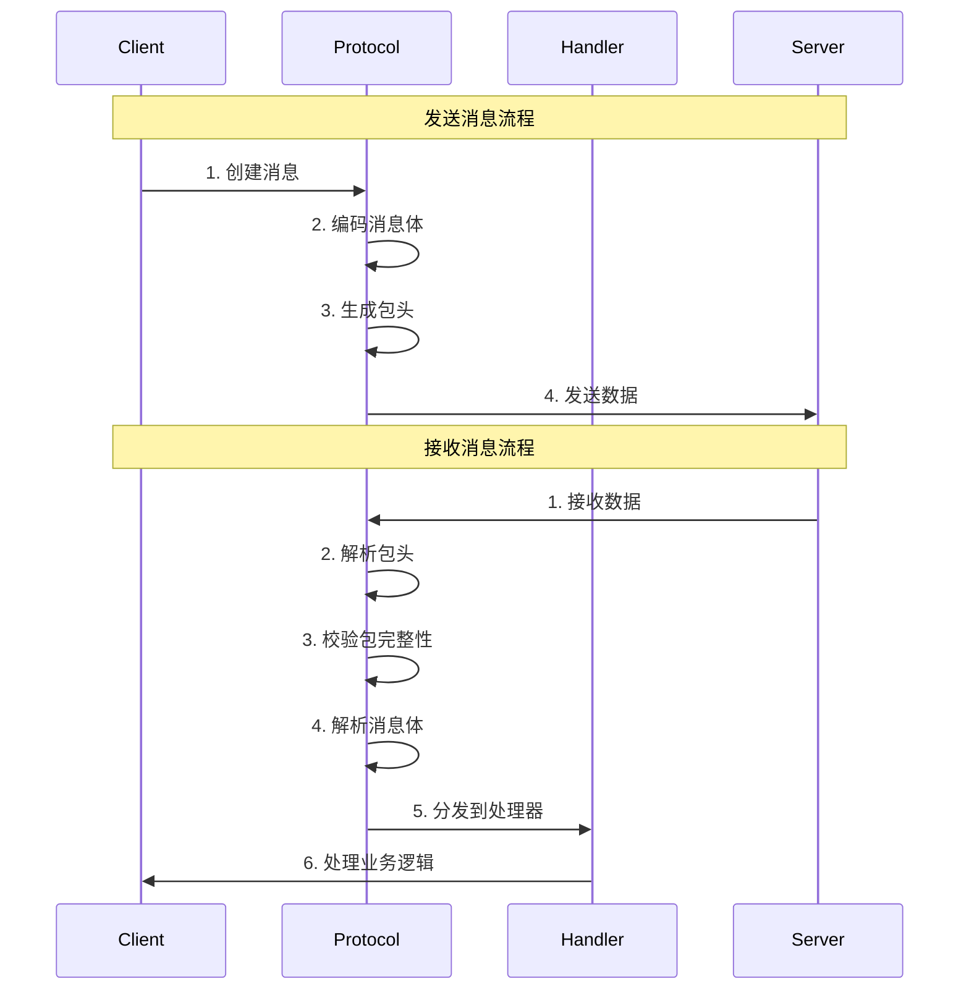

# 游戏客户端框架工作流程

## 核心流程



1. **初始化阶段**
   - 加载配置
   - 初始化各个服务模块
   - 准备运行环境

2. **建立连接**
   - WebSocket连接建立
   - 心跳维护
   - 断线重连处理

3. **登录认证**
   - 设备信息收集
   - Token生成
   - 登录请求发送

4. **业务处理**
   - 协议注册
   - 消息路由
   - 数据处理

5. **数据交互**
   - 请求发送
   - 响应处理
   - 数据缓存

## 详细说明

### 1. 目录结构
```
game_client_framework/
├── core/                    # 核心功能
│   ├── __init__.py
│   ├── connection.py       # 网络连接
│   ├── packet.py          # 数据包处理
│   └── protocol.py        # 协议处理
├── services/               # 业务服务层
│   ├── __init__.py
│   ├── item.py           # 物品相关服务
│   ├── player.py         # 玩家相关服务
│   └── ...
└── protocols/             # 协议处理层
    ├── __init__.py
    ├── item.py           # 物品相关协议
    └── ...
```

### 2. 数据包结构
- **包头格式**（33字节）
  - size (4字节): 整个数据包的大小（包头+数据）
  - messageId (4字节): 消息ID
  - uid (8字节): 用户ID
  - sid (8字节): 会话ID
  - cid (8字节): 客户端ID
  - flag (1字节): 标志位

- **数据包大小分类**：
  1. 等于33字节的包：
     - 只包含包头，没有额外数据
     - 典型例子是心跳包（keepalive）
  2. 大于33字节的包：
     - 包含包头(33字节)和protobuf数据
     - 包头中size = 33 + protobuf数据长度

### 3. 业务开发规范

#### 3.1 协议处理
```python
# protocols/item.py
@dataclass
class ItemProtocols:
    """物品相关协议定义"""
    handlers: Dict[int, Any] = {
        100250: ("C2S_Item_Use", "handle_item_use"),
        100251: ("S2C_Item_Use", "on_item_use_response"),
        # ... 其他协议
    }

    def handle_item_use(self, data: dict) -> dict:
        """处理使用物品请求"""
        return {
            "id": data["id"],
            "num": data["num"],
            "index": data.get("index", 0)
        }
```

#### 3.2 业务服务
```python
# services/item.py
class ItemService:
    """物品服务类"""
    def __init__(self):
        self.protocols = ItemProtocols()
        
    async def use_item(self, item_id: int, num: int = 1, **kwargs) -> dict:
        """使用物品"""
        request = {
            "id": item_id,
            "num": num,
            **kwargs
        }
        return await self.send_protocol(100250, request)
```

### 4. 新版协议框架使用示例

#### 4.1 定义游戏协议
```python
# agame/protocol/game_protocol.py
from gcf.core.protocol.protobuf import ProtobufProtocolBase
from gcf.core.protocol.base import HeaderField, ProtocolConfig

class GameProtocol(ProtobufProtocolBase):
    """游戏协议实现"""
    def __init__(self, config: Optional[ProtocolConfig] = None):
        super().__init__(config)
        
        # 注册包头字段
        self.register_header_field(HeaderField('size', 4, 'int'))
        self.register_header_field(HeaderField('messageId', 4, 'int'))
        self.register_header_field(HeaderField('uid', 8, 'int'))
        self.register_header_field(HeaderField('sid', 8, 'int'))
        self.register_header_field(HeaderField('cid', 8, 'int'))
        self.register_header_field(HeaderField('flag', 1, 'int'))
        
    def is_complete_packet(self, header: Dict[str, Any], remaining: bytes) -> bool:
        """检查是否是完整的包"""
        return header['size'] == self._header_size + len(remaining)
        
    def get_message_type(self, header: Dict[str, Any]) -> Optional[Type[Any]]:
        """根据消息ID获取消息类型"""
        return self._msg_id_to_type.get(header['messageId'])
```

#### 4.2 定义消息处理器
```python
# agame/handlers/login.py
from gcf.core.protocol.handler import HandlerBase
from agame.proto import cs_pb2

class LoginHandler(HandlerBase):
    """登录处理器"""
    async def handle(self, header: Dict[str, Any], message: cs_pb2.CSLogin) -> None:
        try:
            # 1. 提取信息
            uid = header['uid']
            username = message.username
            password = message.password
            
            # 2. 处理登录
            # ... 登录逻辑 ...
            
            # 3. 发送响应
            response = cs_pb2.SCLoginResponse()
            response.result = 0
            response.token = "xxx"
            await self.protocol_manager.send(response, uid=uid)
            
        except Exception as e:
            logger.error(f"登录失败: {e}")
            # 发送错误响应
            response = cs_pb2.SCLoginResponse()
            response.result = 1
            response.error = str(e)
            await self.protocol_manager.send(response, uid=uid)

# agame/handlers/item.py
class ItemUseHandler(HandlerBase):
    """物品使用处理器"""
    async def handle(self, header: Dict[str, Any], message: cs_pb2.CSItemUse) -> None:
        # 也可以使用函数式处理器
        @handler.register_function(cs_pb2.CSItemUse)
        async def handle_item_use(header: Dict[str, Any], message: cs_pb2.CSItemUse) -> None:
            uid = header['uid']
            item_id = message.item_id
            count = message.count
            # ... 处理物品使用逻辑 ...
```

#### 4.3 初始化和使用
```python
# agame/client.py
from gcf.core.protocol import ProtocolManager
from gcf.core.protocol.handler import ProtocolHandler
from gcf.core.network import WebSocketConnection
from .protocol.game_protocol import GameProtocol
from .handlers.login import LoginHandler
from .handlers.item import ItemUseHandler
from .proto import cs_pb2

class GameClient:
    """游戏客户端"""
    def __init__(self):
        # 1. 创建协议配置
        config = ProtocolConfig()
        config.debug_mode = True  # 开发时打开调试
        
        # 2. 创建协议和处理器
        self.protocol = GameProtocol(config)
        self.handler = ProtocolHandler()
        
        # 3. 创建协议管理器
        self.protocol_manager = ProtocolManager(self.protocol, self.handler)
        
        # 4. 注册消息类型
        self.protocol.register_message(100250, cs_pb2.CSLogin)
        self.protocol.register_message(100251, cs_pb2.SCLoginResponse)
        self.protocol.register_message(100252, cs_pb2.CSItemUse)
        self.protocol.register_message(100253, cs_pb2.SCItemUseResponse)
        
        # 5. 注册消息处理器
        self.handler.register(cs_pb2.CSLogin, LoginHandler())
        self.handler.register(cs_pb2.CSItemUse, ItemUseHandler())
        
    async def connect(self, url: str):
        """连接服务器"""
        # 1. 创建连接
        connection = WebSocketConnection()
        await connection.connect(url)
        
        # 2. 设置连接
        self.protocol_manager.set_connection(connection)
        
    async def login(self, username: str, password: str):
        """登录"""
        # 创建登录消息
        login = cs_pb2.CSLogin()
        login.username = username
        login.password = password
        
        # 发送消息
        await self.protocol_manager.send(login)
        
    async def use_item(self, item_id: int, count: int):
        """使用物品"""
        msg = cs_pb2.CSItemUse()
        msg.item_id = item_id
        msg.count = count
        await self.protocol_manager.send(msg)
```

#### 4.4 协议流转过程



### 5. 最佳实践

1. **错误处理**
   - 使用try-except包装所有网络操作
   - 在处理器中捕获业务异常
   - 记录详细的错误日志

2. **消息注册**
   - 统一在一个地方注册所有消息
   - 使用枚举或常量定义消息ID
   - 保持消息ID的唯一性

3. **处理器设计**
   - 一个消息类型对应一个处理器
   - 处理器职责单一
   - 复用通用的处理逻辑

4. **调试支持**
   - 开发环境启用调试模式
   - 记录关键节点的日志
   - 使用统计信息分析性能

5. **性能优化**
   - 使用内存视图减少复制
   - 缓存消息类型映射
   - 及时清理不用的资源

### 6. 关键实现细节

#### 6.1 Token生成实现
```python
def get_token(input_account, game_secret):
    """生成登录Token
    Args:
        input_account: 用户账号
        game_secret: 游戏密钥
    """
    op_id = 2226
    game_id = 400760
    op_game_id = 3149
    account = input_account
    
    # 构造基础信息
    t = {
        "account_system_id": "1_",
        "osdk_game_id": "196377847",
        "user_id": urllib.parse.quote(account),
        "time": int(time.time() * 1000),
        "osdk_user_id": "1_" + account,
        "extend": f"{op_id}|{game_id}|{op_game_id}",
        "channel_id": "1",
    }
    
    # 生成签名
    sorted_t = dict(sorted(t.items()))
    t_str = "&".join([f"{k}={v}" for k, v in sorted_t.items()])
    t_str += game_secret
    t["sign"] = hashlib.md5(t_str.encode("utf-8")).hexdigest()
    
    # base64编码
    osdk_ticket = base64.b64encode(json.dumps(t).encode("utf-8")).decode("utf-8")
    return osdk_ticket
```

#### 6.2 字节流处理
1. **数据包解析**：
```python
def unpack_message(byte_array):
    """解析数据包
    Args:
        byte_array: 原始字节数组
    Returns:
        解析后的数据字典
    """
    # 1. 提取base64字符串（跳过前三个字节的协议头）
    data = byte_array[3:]
    text = ''.join([chr(b) for b in data if 32 <= b <= 126])
    
    # 2. base64解码
    decoded = base64.b64decode(text)
    
    # 3. UTF-8解码
    decoded_str = decoded.decode('utf-8')
    
    # 4. JSON解析
    return json.loads(decoded_str)
```

2. **数据包打包**：
```python
def pack_message(message_id: int, data: dict) -> bytes:
    """打包数据为字节流
    Args:
        message_id: 消息ID
        data: 要发送的数据
    Returns:
        打包后的字节流
    """
    # 1. 构造包头（33字节）
    header = struct.pack('!IIQQQB',
        len(data) + 33,  # 总长度
        message_id,      # 消息ID
        self.uid,        # 用户ID
        self.sid,        # 会话ID
        self.cid,        # 客户端ID
        0               # 标志位
    )
    
    # 2. 序列化数据
    if isinstance(data, (dict, list)):
        data = json.dumps(data).encode('utf-8')
    
    # 3. 组合包头和数据
    return header + data
```

#### 6.3 登录流程详细实现
```python
async def login(self, account: str, password: str) -> bool:
    """登录流程实现
    Args:
        account: 用户账号
        password: 用户密码
    Returns:
        登录是否成功
    """
    try:
        # 1. 生成token
        token = self.get_token(account, self.game_secret)
        
        # 2. 准备登录数据
        login_info = {
            "token": token,
            "version": "1.0.0",
            "sequence_id": int(time.time()),
            "client": {
                "fingerprint_id": "0_0_0",
                "language": "zh",
                "device_os": "DESKTOP_BROWSER",
                "app_version": "0.0.0.0",
                "sdk_version": "1.0.0"
            }
        }
        
        # 3. 发送登录请求
        response = await self.send_protocol(
            100101,  # 登录协议ID
            login_info
        )
        
        # 4. 处理登录响应
        if response["ret"] == 0:
            self.uid = response["uid"]
            self.sid = response["sid"]
            return True
            
        return False
        
    except Exception as e:
        logger.error(f"登录失败: {e}")
        return False
```

#### 6.4 心跳包实现
```python
class HeartbeatManager:
    def __init__(self, interval: int = 15):
        self.interval = interval
        self.last_time = 0
        
    async def check_heartbeat(self):
        """检查并发送心跳包"""
        current_time = time.time()
        if current_time - self.last_time > self.interval:
            await self.send_heartbeat()
            self.last_time = current_time
            
    async def send_heartbeat(self):
        """发送心跳包"""
        try:
            response = await self.send_protocol(10006, {})  # 心跳协议ID
            if response["ret"] == 0:
                logger.debug(f"心跳包发送成功: {self.uid}")
            else:
                logger.warning(f"心跳包发送失败: {response['ret']}")
        except Exception as e:
            logger.error(f"心跳包发送异常: {e}")
